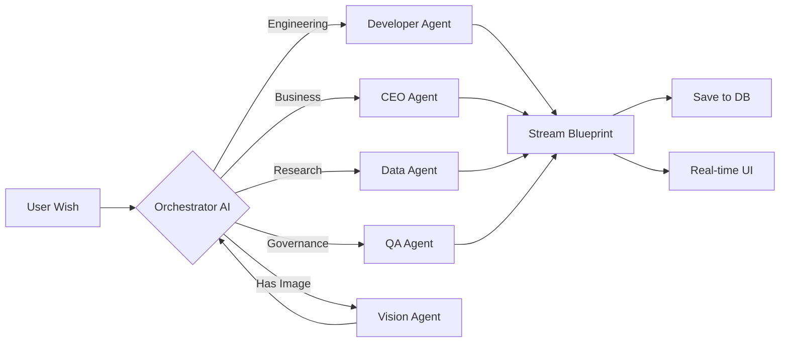

<div align="center">


# 🪄 JINI Prompter

### The World's First AI Blueprint Architect

**Turn any wish into a production-ready reality — powered by a multi-agent AI cognitive framework.**

[](https://nextjs.org/)
[](https://react.dev/)
[](https://www.typescriptlang.org/)
[](https://www.prisma.io/)
[](https://tailwindcss.com/)
[](LICENSE)

[🚀 Live Demo](#) · [📖 Documentation](#-documentation) · [🐛 Report Bug](../../issues) · [💡 Request Feature](../../issues)

---

</div>

## 🌟 What is JINI Prompter?

**JINI Prompter** is not just another prompt generator — it's an **AI-powered Blueprint Architect** that transforms a simple wish (like *"Build me an AI SaaS"*) into a **complete, production-ready blueprint** with:

- 🧠 **Master Prompts** — Expert-level, context-aware prompts optimized for any AI model
- 🏗️ **Architecture Plans** — Full tech stack recommendations with scalability strategies
- 📊 **Execution Roadmaps** — Phase-by-phase implementation plans with milestones
- 🤖 **Custom AI Agents** — Create, train, and deploy specialized AI agents with memory
- 📈 **Quality Scoring** — Real-time analysis of clarity, structure, reasoning, and optimization
- 🖼️ **Vision Analysis** — Upload images and get AI-reconstructed design specifications

<br/>

<div align="center">

```
         ┌──────────────────────────────────────────────┐
         │             🪄 Your Wish Goes In              │
         └──────────────────────┬───────────────────────┘
                                │
                    ┌───────────▼───────────┐
                    │   🎯 ORCHESTRATOR AI   │
                    │   Domain Classification │
                    │   Complexity Analysis   │
                    └───────────┬───────────┘
                                │
              ┌─────────────────┼─────────────────┐
              │                 │                 │
     ┌────────▼──────┐  ┌──────▼───────┐  ┌──────▼──────┐
     │  👔 CEO Agent  │  │ 💻 Dev Agent │  │ 🔬 QA Agent │
     │   Strategy &   │  │ Architecture │  │  Security & │
     │   Business     │  │  & Code      │  │  Compliance │
     └────────┬──────┘  └──────┬───────┘  └──────┬──────┘
              │                │                 │
              └─────────────────┼─────────────────┘
                                │
                    ┌───────────▼───────────┐
                    │  📋 COMPLETE BLUEPRINT │
                    │  Ready for Production  │
                    └───────────────────────┘
```

</div>

<br/>

## ⚡ Key Features

<table>
<tr>
<td width="50%">

### 🧠 Multi-Agent Cognitive Framework
A sophisticated multi-model routing system that dynamically assigns specialized AI agents based on domain classification:
- **CEO Agent** — Business strategy & executive planning
- **Developer Agent** — Technical architecture & code
- **Data Agent** — Research, analytics & market intelligence
- **QA Agent** — Security, compliance & risk assessment
- **Vision Agent** — Image analysis & design reconstruction

</td>
<td width="50%">

### 🪄 Wish-to-Blueprint Engine
Type a single sentence — get a complete production blueprint:
- Perfected master prompt (10x better than your input)
- Full architecture with tech stack recommendations
- Step-by-step execution roadmap
- Real-time quality scoring across 6 dimensions
- Business viability analysis

</td>
</tr>
<tr>
<td width="50%">

### 🤖 Custom Agent Builder
Create your own AI agents with persistent memory:
- Visual DNA editor with drag-and-drop configuration
- Agent personality & reasoning style customization
- Vector-based memory with RAG retrieval
- Import/export agent configurations as JSON
- Public agent marketplace (coming soon)

</td>
<td width="50%">

### 🎨 Premium UI/UX
Built with cutting-edge web technologies:
- 3D particle fields with Three.js & React Three Fiber
- Glassmorphism design with animated gradients
- Framer Motion animations throughout
- Fully responsive across all devices
- Dark mode optimized interface

</td>
</tr>
</table>

## 🛠️ Tech Stack

| Layer | Technology | Purpose |
|-------|-----------|---------|
| **Framework** | Next.js 16 (App Router) | Server-side rendering, API routes, streaming |
| **Frontend** | React 19 + TypeScript 5 | Component architecture with type safety |
| **Styling** | Tailwind CSS 4 | Utility-first responsive design |
| **3D Graphics** | Three.js + React Three Fiber | Immersive particle effects & 3D scenes |
| **Animations** | Framer Motion | Smooth page transitions & micro-interactions |
| **AI/LLM** | Vercel AI SDK + OpenRouter | Multi-model streaming with agent routing |
| **Auth** | NextAuth.js v5 | GitHub, Google, and magic link authentication |
| **Database** | Prisma ORM + SQLite | Type-safe database access with migrations |
| **Validation** | Zod v4 | Runtime schema validation for AI outputs |
| **Icons** | Lucide React | Beautiful, consistent iconography |

## 🚀 Quick Start

### Prerequisites

- **Node.js** 18+ ([download](https://nodejs.org/))
- **npm** or **pnpm**

### Installation

```bash
# 1. Clone the repository
git clone https://github.com/hackwithayush/jini_prompter.git
cd jini_prompter

# 2. Install dependencies
npm install

# 3. Set up environment variables
cp .env.example .env
```

### Environment Variables

Create a `.env` file in the root directory:

```env
# Database
DATABASE_URL="file:./prisma/dev.db"

# Auth (NextAuth.js)
AUTH_SECRET="your-secret-key"    # Generate with: npx auth secret

# GitHub OAuth
GITHUB_ID="your-github-client-id"
GITHUB_SECRET="your-github-client-secret"

# Google OAuth
GOOGLE_ID="your-google-client-id"
GOOGLE_SECRET="your-google-client-secret"

# AI Provider (OpenRouter)
OPENROUTER_API_KEY="your-openrouter-api-key"
```

### Run Locally

```bash
# Generate Prisma client & start dev server
npm run dev
```

Open [http://localhost:3000](http://localhost:3000) and start making wishes! 🪄

## 📁 Project Structure

```
jini_prompter/
├── prisma/
│   └── schema.prisma          # Database schema (User, Agent, Blueprint, Memory)
├── public/                    # Static assets
├── src/
│   ├── app/
│   │   ├── api/
│   │   │   ├── generate/      # Blueprint generation API (streaming)
│   │   │   ├── auth/          # NextAuth.js routes
│   │   │   ├── feedback/      # User feedback collection
│   │   │   └── upload/        # Image upload for vision analysis
│   │   ├── dashboard/         # Protected dashboard pages
│   │   │   ├── agents/        # Agent CRUD & DNA editor
│   │   │   └── blueprints/    # Blueprint management
│   │   ├── generate/          # Blueprint generation page
│   │   ├── login/             # Authentication page
│   │   └── page.tsx           # Landing page
│   ├── components/
│   │   ├── landing/           # 17 landing page sections
│   │   ├── ui/                # Reusable UI primitives
│   │   └── icons/             # Custom icon components
│   ├── lib/
│   │   ├── agents/            # AI model configs & embeddings
│   │   ├── context/           # React context providers
│   │   ├── types.ts           # TypeScript type definitions
│   │   └── prisma.ts          # Database client singleton
│   └── utils/                 # Logger & request queue
├── .env.example               # Environment variable template
├── package.json
└── tsconfig.json
```

## 🧪 How the AI Pipeline Works



1. **Wish Input** — User types a natural language wish + optional image upload
2. **Orchestration** — Small, fast model classifies domain, complexity, and execution mode
3. **Agent Routing** — Request is routed to the optimal specialist model
4. **Vector RAG** — If a custom agent has memories, cosine similarity finds relevant context
5. **Streaming Generation** — Blueprint is streamed in real-time with structured JSON output
6. **Quality Scoring** — 6-dimension quality analysis: clarity, structure, reasoning, optimization, conversion, overall
7. **Persistence** — Blueprint saved to database with full audit trail

## 🤝 Contributing

Contributions make the open source community amazing! Any contributions you make are **greatly appreciated**.

1. Fork the Project
2. Create your Feature Branch (`git checkout -b feature/AmazingFeature`)
3. Commit your Changes (`git commit -m 'Add some AmazingFeature'`)
4. Push to the Branch (`git push origin feature/AmazingFeature`)
5. Open a Pull Request

## 📄 License

Distributed under the MIT License. See [`LICENSE`](LICENSE) for more information.

## 💬 Connect

<div align="center">

**Built with 🪄 by [Ayush Chaudhary](https://github.com/hackwithayush)**

If this project helped you, please consider giving it a ⭐ — it means the world!

[](../../stargazers)
[](../../network/members)

</div>
