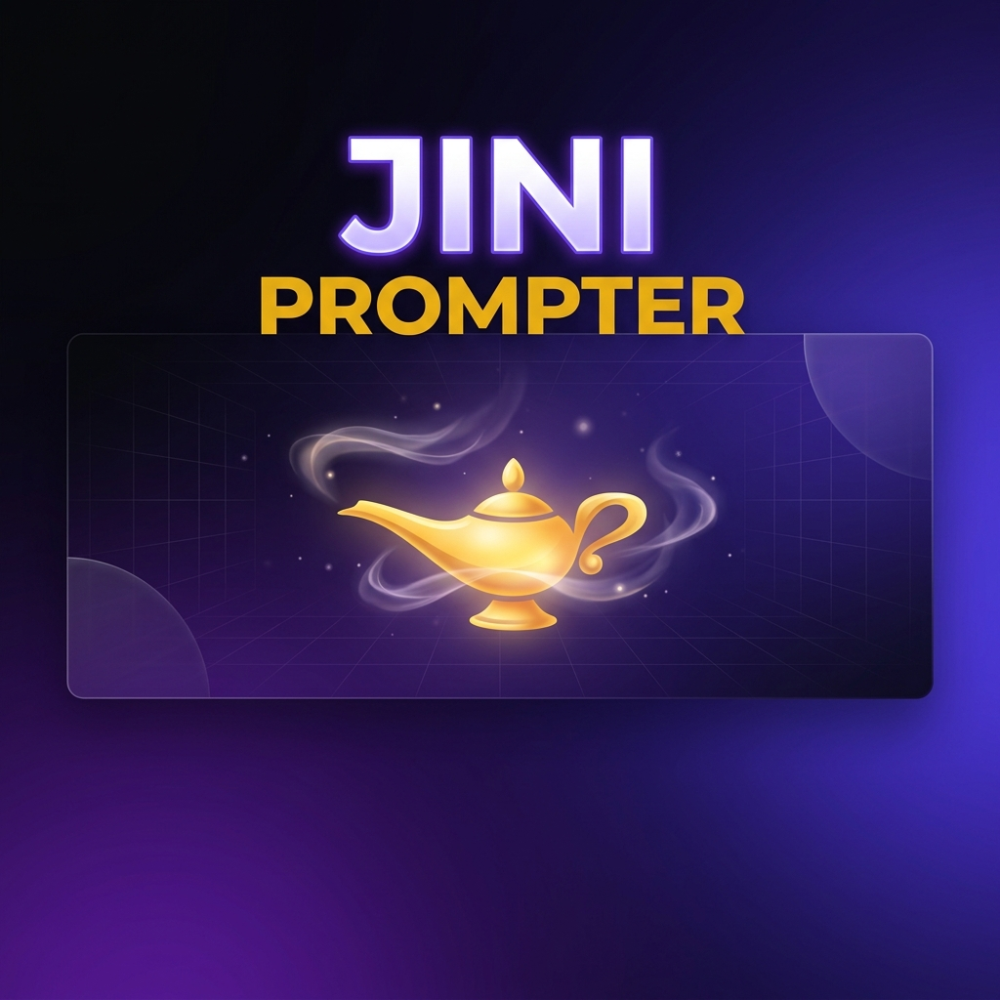

<div align="center">



# JINI Prompter

**I got tired of writing the same prompts over and over. So I built an AI that writes better prompts than me.**

[](https://nextjs.org/)
[](https://www.typescriptlang.org/)
[](LICENSE)

</div>

---

## The Problem

Every time I wanted to build something with AI, I spent more time crafting the perfect prompt than actually building. And the prompts I wrote? Honestly, they were mid.

So I thought — what if I just describe what I want in plain English, and an AI figures out the best way to prompt *another* AI to build it?

That's JINI Prompter. You type a wish. It gives you back a full blueprint.

## What It Actually Does

You type something like:

> *"Build me a SaaS that helps freelancers track invoices"*

And JINI gives you back:

- **A master prompt** — way more detailed than what you wrote, optimized for AI models
- **Architecture plan** — what tech stack to use and why
- **Execution roadmap** — step-by-step plan with phases and milestones
- **Quality scores** — how clear, structured, and business-viable your idea is
- **Agent workflows** — which AI agents worked on your blueprint and what they did

It's not just a text generator. There's a whole multi-agent system under the hood that routes your request to specialized AI models depending on whether your wish is about engineering, business, research, or creative work.

## How It Works (The Interesting Part)

I built a pipeline where multiple AI agents collaborate on your request:

```
Your wish → Orchestrator (classifies it) → Specialist Agent → Streamed Blueprint
```

Here's the flow:

1. **You type a wish** — can also upload an image for visual context
2. **Orchestrator AI** — a fast, small model figures out the domain (engineering? business? creative?) and complexity
3. **Agent routing** — based on the classification, it picks the right specialist:
   - Business strategy → CEO Agent (deep reasoning model)
   - Software architecture → Developer Agent  
   - Market research → Data Agent
   - Security/compliance → QA Agent
   - Image uploaded → Vision Agent analyzes it first
4. **Streaming response** — the blueprint streams back in real-time with structured sections
5. **Saved to your dashboard** — everything is persisted so you can come back to it

The cool part is you can also **create your own custom agents** with persistent memory. The memory system uses vector embeddings + cosine similarity for RAG retrieval, so your agent actually remembers context from past interactions.

## Tech Stack

Nothing too crazy — just solid, modern tools:

- **Next.js 16** (App Router) for the framework
- **React 19** + **TypeScript** for the frontend
- **Tailwind CSS 4** for styling
- **Three.js** + **React Three Fiber** for the particle effects on the landing page
- **Framer Motion** for animations
- **Vercel AI SDK** + **OpenRouter** for the multi-model AI pipeline
- **NextAuth.js v5** for auth (GitHub, Google, magic links)
- **Prisma** + **SQLite** for the database
- **Zod** for validating AI outputs (because LLMs love to hallucinate JSON)

## Getting Started

```bash
# clone it
git clone https://github.com/hackwithayush/jini_prompter.git
cd jini_prompter

# install deps
npm install

# set up your env vars (check .env.example for what you need)
cp .env.example .env

# run it
npm run dev
```

You'll need API keys for OpenRouter (for the AI models) and optionally GitHub/Google OAuth for auth. Everything's documented in `.env.example`.

## Project Structure

```
src/
├── app/
│   ├── api/generate/       # the main AI pipeline (this is where the magic happens)
│   ├── api/auth/           # NextAuth routes
│   ├── api/feedback/       # user feedback collection
│   ├── api/upload/         # image uploads for vision analysis
│   ├── dashboard/          # your blueprints and agents
│   ├── generate/           # generation page
│   └── page.tsx            # landing page
├── components/
│   ├── landing/            # all the landing page sections (17 of them lol)
│   └── ui/                 # reusable components
├── lib/
│   ├── agents/             # AI model configs and embedding utils
│   ├── types.ts            # TypeScript types
│   └── prisma.ts           # DB client
└── prisma/
    └── schema.prisma       # database schema
```

The most interesting file is probably `src/app/api/generate/route.ts` — that's the entire multi-agent pipeline in ~280 lines.

## Screenshots

*Coming soon — I'm still polishing the UI*

## Contributing

If you find this useful or interesting, contributions are welcome! Just fork it, make your changes, and open a PR.

If you find a bug, [open an issue](../../issues) — I'll try to fix it quickly.

## License

MIT — do whatever you want with it.

---

<div align="center">

Built by [Ayush](https://github.com/hackwithayush) · If you found this helpful, a ⭐ would make my day

</div>
